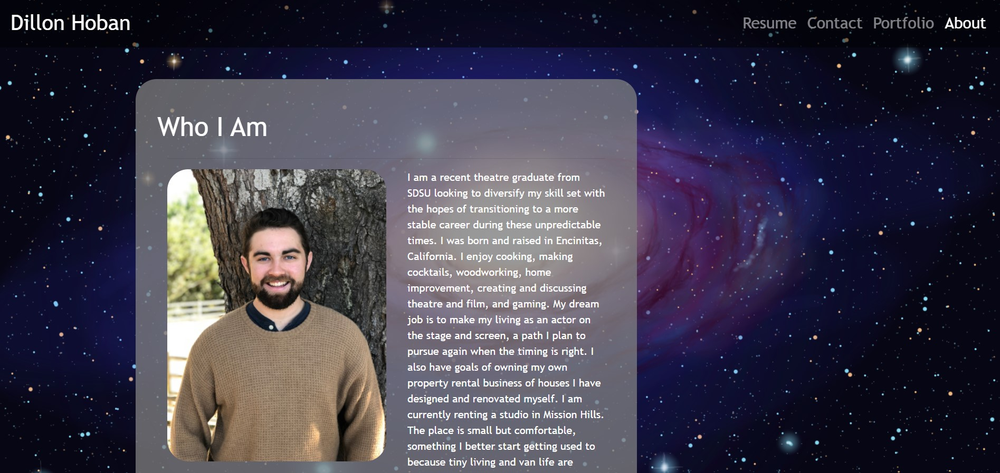

# My React Portfolio
This project was bootstrapped with [Create React App](https://github.com/facebook/create-react-app).

## Description

I am a student in the UCSD Coding Bootcamp expecting to graduate in March of 2021. This is my second portfolio! This site was dynamically built using React. 

The site has four pages: 
1. About contains a brief bio and headshot.
2. Portfolio with images and links to some of my finished projects.
3. Contact contains a basic form that will be improved in future updates (see below.)
4. Resume contains a downloadable PDF version of my current resume, as well as links to my GitHub and LinkedIn profiles. 

All pages are styled using the same stylesheet and each have unique Bootstrap elements. 

## Deployment

Click the link [here](https://dillonhoban.github.io/Responsive_Portfolio/) to check out my site in your browser.

## Future Updates

<li> Continue development

## Validation 
This site’s HTML was validated using a third party service found [here.](https://validator.w3.org/)

## Acknowledgments
A special thank you to [Christina](https://github.com/Christina2021), [Ravi](https://github.com/ravifindravicom), [Brian](https://github.com/btparker70), and [Emily](https://github.com/ethomas22) and all the members of the Awesome Study Group. 

  
  
  
   
  
  
  

